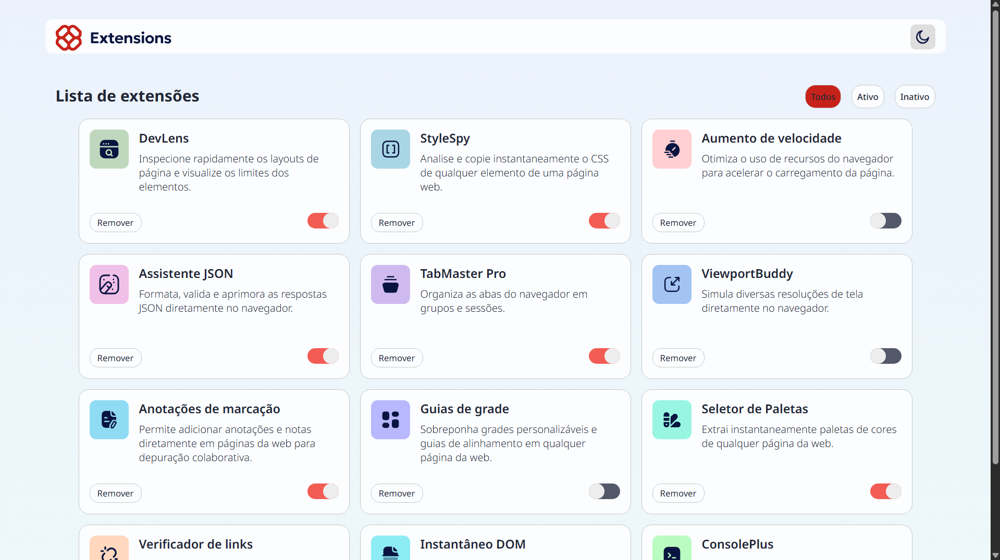
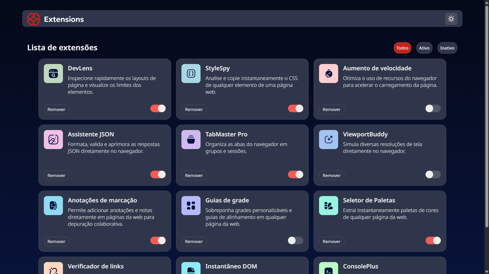

# ⚙️ Extension manager 

🔗 **Links**

- 🌐 [View Project](https://seu-projeto.vercel.app)
- 📂 [Repository](https://github.com/luciane003/https://github.com/luciane003/extension-manager/)

### 🇺🇸 English

## 📖 About the Project

The Extension Manager is an application that allows you to view and manage extensions in a simple and intuitive way. With it, users can track the status of installed extensions, activate or deactivate them as needed, and better organize their browsing experience.

## ✨ Features

- View the list of available extensions.
- Enable and disable extensions.
- Filter extensions by status.
- Responsive and intuitive interface.
- Alternating between light and dark themes.

## 🛠️ Technologies Used
<p>
    
    
    
    
    
</P>  

## 📸 Screenshot
### Clear Theme

<p>
    />
</p>

### Dark Theme 

<p>
    />
</p>

## 🚀 How to execute the Project

### Prerequisites

- Node.js installed
- npm or yarn

### Passos

1. Clone the repository:

```bash
git clone https://github.com/luciane003/extension-manager.git
```

2. Access the project folder:

```bash
cd your-repository
```

3. Install dependencies:

```bash
npm install
```

4. Start the development server:

```bash
npm run dev
```

5. Open your browser and access:

```bash
http://localhost:5173
```

## 🎯 Learnings

During the development of this project, I deepened my knowledge of React, especially in state management with useState. I learned how to control interface changes based on user actions, such as changing themes and enabling or disabling extensions. I also practiced dynamically applying classes through className, allowing components to react to state changes with each click.

## 🔮 Melhorias Futuras

At the moment, I don't intend to make any further updates, as the project was completed based on my current knowledge. However, as I continue to advance my studies and acquire new skills, I plan to revisit this project to implement improvements and new features.

### 🇧🇷 Português

## 📖 Sobre o Projeto

O Gerenciador de Extensões é uma aplicação que permite visualizar e gerenciar extensões de forma simples e intuitiva. Com ele, os usuários podem acompanhar o status das extensões instaladas, ativá-las ou desativá-las conforme necessário e organizar melhor sua experiência de navegação.

## ✨ Funcionalidades

- Visualizar a lista de extensões disponíveis.
- Ativar e desativar extensões.
- Filtrar extensões por status.
- Interface responsiva e intuitiva.
- Alternância entre temas claro e escuro.

## 🛠️ Tecnologias Utilizadas
<p>
    
    
    
    
    
</P>  

## 📸 Captura de Tela
### Tema claro

<p>
    />
</p>

### Tema escuro

<p>
    />
</p>

## 🚀 Como executar o Projeto

### Pré-requisitos

- Node.js instalado
- npm ou yarn

### Passos

1. Clone o repositório:

```bash
git clone https://github.com/luciane003/extension-manager.git
```

2. Acesse a pasta do projeto:

```bash
cd seu-repositorio
```

3. Instale as dependências:

```bash
npm install
```

4. Inicie o servidor de desenvolvimento:

```bash
npm run dev
```

5. Abra o navegador e acesse:

```bash
http://localhost:5173
```

## 🎯 Aprendizados

Durante o desenvolvimento deste projeto, aprofundei meus conhecimentos em React, especialmente no gerenciamento de estados com o useState. Aprendi a controlar alterações na interface com base nas ações do usuário, como a mudança de tema e a ativação ou desativação de extensões. Também pratiquei a aplicação dinâmica de classes através do className, permitindo que os componentes reagissem às mudanças de estado a cada clique.

## 🔮 Melhorias Futuras

No momento, não pretendo realizar novas atualizações, pois o projeto foi concluído de acordo com os conhecimentos que possuo atualmente. No entanto, conforme eu continuar evoluindo meus estudos e adquirindo novas habilidades, pretendo revisitar este projeto para implementar melhorias e novas funcionalidades.

## 👩‍💻 Autora
Luciane Kellen
